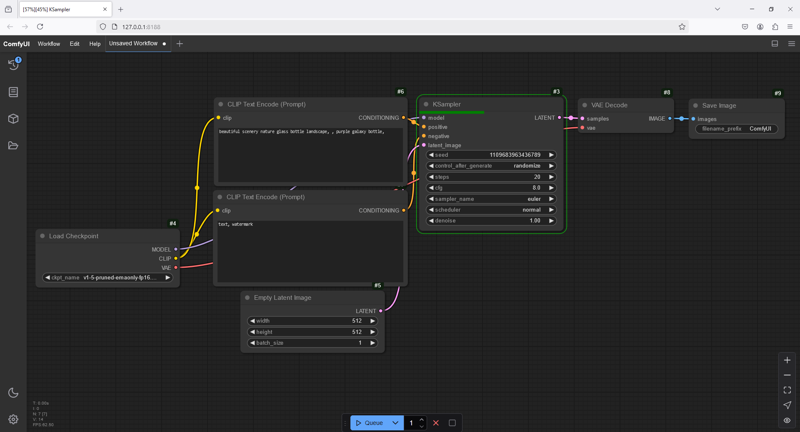

# 🎨 AI Art Gallery - ComfyUI Stable Diffusion 🖼️  

🚀 **Welcome to my AI Art Showcase!**  

This repository features a collection of **AI-generated images** created using **Stable Diffusion** with **ComfyUI**. From **realistic landscapes** to **dreamlike fantasy worlds**, every image here is a product of cutting-edge artificial intelligence.  

💡 **Discover the future of AI-powered creativity!**  

---

## 🛠 What is ComfyUI?  

[ComfyUI](https://github.com/comfyanonymous/ComfyUI) is an **advanced graphical user interface (GUI)** for **Stable Diffusion**, designed for **AI-powered image generation** with a **node-based workflow**.  

### 🔹 **Why Use ComfyUI?**  
✅ **Drag-and-drop interface for easy workflow management**  
✅ **Optimized for high-performance image generation**  
✅ **Supports LoRA, ControlNet, and other AI fine-tuning tools**  
✅ **Allows advanced customization with samplers and models**  

### 🖥️ **ComfyUI System Interface**  
Here's a glimpse of **ComfyUI in action**:  

  

---

## 🌟 What is Stable Diffusion?  

[Stable Diffusion](https://stablediffusionweb.com/) is a **deep learning model** that generates high-quality images from text descriptions. Developed by **Stability AI**, it is designed for:  

✔️ **Photorealistic AI-generated images**  
✔️ **Fantasy, sci-fi, and anime-style artwork**  
✔️ **Character design & concept art**  
✔️ **Abstract and surreal compositions**  

Stable Diffusion is **open-source**, making AI-generated visuals accessible to creators worldwide.  

---

## 🎨 AI-Generated Image Showcase  

Here are some **example AI-generated images** using **ComfyUI Stable Diffusion**:  

<table>
  <tr>
    <td align="center"><strong>🐶 Dog</strong></td>
    <td align="center"><strong>🏡 House</strong></td>
    <td align="center"><strong>🌿 Nature</strong></td>
  </tr>
  <tr>
    <td></td>
    <td></td>
    <td></td>
  </tr>
</table>  

---

## 📂 **View More AI-Generated Images**  

🔗 **[Click here to explore the full gallery](./ComfyUI_Output/)**  

---

## ⭐ Support This Project  

🚀 **Love AI art? Support this project!**  

✅ **Star this repo** ⭐  
✅ **Share it with AI enthusiasts** 🔄  
✅ **Follow for more AI-generated content** 🎨  

💡 **Join the AI art revolution and explore endless creative possibilities!**  
